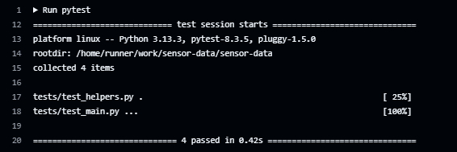

# Phase 3 – App Development & CI/CD Implementation

Phase 3 focused on how the Sensor Data App will be built, tested, and automated. The app retrieves temperature data from openSenseMap and ensures it's up to date. It follows best practices for Git commits, containerization, and CI/CD to make development smooth, secure, and efficient.

## Architectural Diagram 

--- 

### Project Impact

> This project demonstrates *DevOps best practices* and automation, focusing on **real-time data processing, containerization, and continuous integration**. The API retrieves and processes sensor data efficiently, ensuring freshness and reliability.  
> By implementing Docker best practices and **GitHub Actions for CI/CD, and Docker optimizations**, the application becomes **scalable, secure, and maintainable**. This structured approach enhances development efficiency while maintaining best practices in Git workflow and security.  
> The documentation provides a **technical breakdown of implementation, problem-solving, and automation processes**. 

## Objectives

#### **1. Git & Code Standards**  
- Use **Conventional Commits** for clear and structured commit messages.  
- Implement the backend using **Flask or FastAPI** for API development.  
- Write **unit tests** for all API endpoints to ensure reliability.  

#### **2. API Endpoints & Functionality**  
- **/version** – Returns the deployed app version (no parameters).  
- **/temperature** – Returns the average temperature based on all senseBox data (latest within 1 hour).  

#### **3. Containerization Best Practices**  
- Follow **Docker Best Practices** for security and efficiency.  

#### **4. Continuous Integration (CI) Pipeline**  
- Set up a **GitHub Actions** workflow for automation.  
- Include the following steps:  
  - **Linting** for Dockerfile.  
  - **Building** a Docker image.  
  - **Running unit tests** for API reliability.  

#### **5. Testing & Validation**  
- Ensure the **/temperature** endpoint returns correct values in CI.  
  

  
 

# Work Done

### 1. Familiarize with openSenseMap API

* I explored and used the [openSenseMap API](https://docs.opensensemap.org/) to:

  * Fetch real-time sensor data from public senseBoxes.
  * Filter out temperature data no older than **1 hour**.
  * Compute the average temperature from that dataset.

 

## 2. Implement Flask App (Code Requirements)

* I used **Flask** framework to build the API.
* I created two endpoints:

    ####  `/version`

    * Returns the current version of the deployed app.
    * Version value is stored in `main.py`.

    ####  `/temperature`

    * Fetches temperature data from 3 openSenseMap sense boxes.
    * Filters data from the **last 1 hour** only.
    * Returns the **average temperature** from all recent data points.

 

## 3. Unit Tests for All Endpoints

* I created tests using **Python’s `unittest`** framework.
* Each endpoint has a dedicated test:

  * `/version` → Checks the correct version string is returned.
  * `/temperature` → Uses mocked API responses to test logic for:

    * Calculating average
    * Filtering by timestamp
    * Handling invalid/missing data

 

## 4. Containers – Apply Docker Best Practices

* Wrote a  **single-stage Dockerfile** for simpler development and faster builds.
* Followed Docker best practices:

  1. **Used small base image** → Reduces attack surface and improves efficiency by minimizing unused dependencies.  
  2. **Used `.dockerignore`** → Prevents unnecessary files from being copied into the image, reducing build size and speeding up builds.  
  3. **Set working directory** → Ensures consistency, making file paths predictable and preventing unnecessary complexity in Docker commands.  
  4. **Used `ENTRYPOINT` and `CMD` together** → Allows defining a default executable (`ENTRYPOINT`) while keeping flexibility to override runtime arguments (`CMD`).  
  5. **Installed only needed packages** → Reduces bloat, improves security, and speeds up container startup by eliminating unnecessary dependencies.  
  6. **Avoided caching** → Ensures fresh dependencies and avoids outdated packages being reused, preventing unexpected bugs in deployments.  

This keeps the container **lightweight, efficient, and secure** while following best practices.

* Built, tagged and tested the image locally using docker commands - `docker build`, `docker run` and `docker logs`.

 
 
## 5. Continuous Integration – GitHub Actions Workflow

#### Triggered On:

* Pushes to `ci/setup-ci-pipeline`
* Pull requests to `develop`

#### Steps Included:

1. **Checkout Code**
2. **Set Up Python Environment**
3. **Install Dependencies**
4. **Run Unit Tests**

   * Automatically runs tests for both endpoints.
5. **Lint Dockerfile**

   * Using **Hadolint**, a Docker-specific linter that flags bad practices.
6. **Build Docker Image**

   * Ensures the Dockerfile builds without errors and the app can run inside a container.

 

## 6. CI Pipeline Testing

* In the GitHub Actions workflow, I included a step that **calls the `/temperature` endpoint** and **checks the response**.
* This confirms the app is running correctly **after the image is built** and that the version endpoint works as expected.

 

##  What I Learned

* How to fetch and process real-time sensor data using an external API (openSenseMap)
* How to **write meaningful unit tests** with mocks
* How to **lint and build** Docker images in CI
* The difference between **multi-stage** and **single-stage Dockerfiles**, and when to use each.
* How to **design and debug a CI pipeline** using GitHub Actions
* How to use `git rebase -i` and squash commits to keep a clean project history

 

## Git Workflow

* Used a **develop-based branching strategy**:

* All features branched off `develop` and merged back into it.
* Feature branches used in this phase:

    * `feature/app-endpoints`
    * `docker-support`
    * `ci/setup-ci-pipeline`
    * `feat/simplify-dockerfile`

* Before merging:

  * Cleaned up with `git rebase -i`
  * Used clear PR titles and descriptions
  * Followed the [Conventional Commits](https://www.conventionalcommits.org/en/v1.0.0/) spec

* Merged latest stable work to `main`
* Used **semantic versioning** (e.g., `v1.0.0`) to tag stable releases.  

 

## Final Outcome

* All unit tests passed:

  

* CI workflow triggers (pushes and PRs to main) and runs correctly:

 

* Dockerfile builds successfully and passes linting:

  
  

* `/temperature` endpoint tested and validated:

  

 

## Summary

This phase helped me bridge the gap between local development and production-readiness by using real APIs, containers, and automation.

 I made sure my app is **testable**, **dockerized**, and **CI-ready**, just like in a real-world DevOps.

Note: Each phase of this project builds on the last.

---

